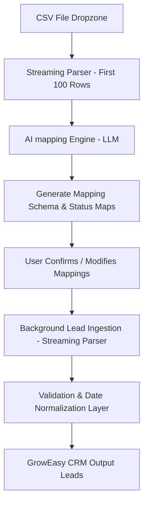

# GrowEasy CRM AI-Powered CSV Importer

An enterprise-grade, high-performance, AI-driven CSV importer built to intelligently map, clean, validate, and import leads from ANY custom CSV format (Facebook Leads, Google Ads, LinkedIn, HubSpot, Salesforce, or scrambled/unknown layouts) into the standardized GrowEasy CRM structure.

## High-Level Architecture

The system utilizes a **hybrid streaming-AI parsing pipeline** to support files containing **100K+ records** with optimal latency and minimal memory footprint:



1. **Schema & Status Value Ingestion (Sample)**:
   The backend reads only the headers and the first 100 rows using a streaming CSV parser. It also extracts unique status values from potential status columns.
2. **Semantic Columns Resolution (LLM)**:
   It feeds the column names, sample rows, and unique status values into the Google Gemini (or OpenAI) LLM to map columns to CRM fields, identify date formats, and translate messy status vocabularies into the 4 standard CRM statuses.
3. **User Confirmation**:
   The frontend displays the AI-inferred schema and status mappings. Users can review, adjust dropdown fields, and manually correct mappings.
4. **Streaming Transformation Pipeline**:
   Upon confirmation, the backend spawns a background promise that streams the full file. It processes records in batches of 100:
   - Splits full names into `first_name` and `last_name`.
   - Preserves unmapped column values by merging them into `crm_note`.
   - Translates date formats dynamically using regular expressions and inferred formats.
   - Normalizes email and mobile duplicates.
   - Preserves multi-value lists (comma-separated emails or phones) by keeping the first as primary and appending the rest to `crm_note`.
   - Filters out rows missing BOTH contact fields.
   - Saves clean leads into the leads database and details validation failures (with row number and errors) into a failures log.

---

## Tech Stack

### Frontend
- **Framework**: Next.js 15 (App Router, React 19)
- **State Management**: TanStack React Query (polling metrics & job progress)
- **Styling**: Tailwind CSS v4, custom glassmorphism components
- **Utilities**: Lucide Icons, React Dropzone

### Backend
- **Platform**: Node.js, Express, TypeScript
- **JSON Database**: Local File-based Repository Layer supporting SOLID dependency inversion
- **Parsing**: `csv-parser` stream reader
- **LLMs**: Google Gemini SDK (`@google/generative-ai`) and OpenAI SDK (`openai`)
- **Testing**: Jest, ts-jest

---

## Folder Structure

```text
GrowEasy/
├── backend/
│   ├── src/
│   │   ├── config/          # Configurations & env validators
│   │   ├── controllers/     # API request handlers (Upload, Import, Jobs)
│   │   ├── middleware/      # Rate limiters, global exception catchers
│   │   ├── prompts/         # AI structured prompts & JSON schemas
│   │   ├── repositories/    # File-based DB implementations (DIP compliant)
│   │   ├── services/        # Ingestion pipeline, AI, and CSV parsers
│   │   ├── utils/           # Date normalizers, phone checkers, loggers
│   │   └── server.ts        # App server setup
│   ├── tests/               # Jest unit tests (Date parsing, validations)
│   ├── Dockerfile
│   └── package.json
├── frontend/
│   ├── src/
│   │   ├── app/             # Next.js 15 App router (Dashboard, Details)
│   │   ├── components/      # Glassmorphism UI components (Card, Button, Progress)
│   │   ├── providers/       # Client-side React Query contexts
│   │   ├── utils/           # API fetch helpers
│   │   └── globals.css      # Core styles & animations
│   ├── Dockerfile
│   └── package.json
├── shared/
│   └── types.ts             # Shared interfaces between frontend & backend
├── docker-compose.yml
└── README.md
```

---

## API Endpoints

### 1. Upload CSV
- **POST** `/api/upload`
- **Payload**: Multipart file (`file` key)
- **Response**:
  ```json
  {
    "message": "CSV file uploaded and parsed successfully.",
    "jobId": "uuid-here",
    "filename": "leads.csv",
    "headers": ["fname", "lname", "email", "status"],
    "sampleRows": [{"fname": "John", "lname": "Doe", "email": "john@gmail.com", "status": "Hot"}],
    "totalRows": 1540
  }
  ```

### 2. Trigger AI Analysis
- **POST** `/api/import/:id/analyze`
- **Response**:
  ```json
  {
    "jobId": "uuid-here",
    "mappingSchema": {
      "confidence": 95,
      "mapped_fields": {
        "fname": "first_name",
        "lname": "last_name",
        "email": "email",
        "status": "crm_status"
      },
      "status_mapping": {
        "Hot": "GOOD_LEAD_FOLLOW_UP"
      },
      "date_column": null,
      "date_format": null,
      "reason": "AI mapped name, email, and lead status."
    }
  }
  ```

### 3. Start Lead Processing
- **POST** `/api/import/:id/start`
- **Payload**:
  ```json
  {
    "mapped_fields": { "fname": "first_name", "email": "email" },
    "status_mapping": { "Hot": "GOOD_LEAD_FOLLOW_UP" },
    "date_column": "signup_date",
    "date_format": "YYYY-MM-DD"
  }
  ```
- **Response**:
  ```json
  {
    "message": "Lead import processing has started in the background.",
    "jobId": "uuid-here",
    "status": "PROCESSING"
  }
  ```

### 4. Health Check
- **GET** `/health`
- **Response**:
  ```json
  {
    "status": "healthy",
    "uptime": 124.5,
    "providerConfigured": {
      "gemini": true,
      "openai": false
    }
  }
  ```

### 5. Metrics Check
- **GET** `/metrics`
- **Response**:
  ```json
  {
    "totalJobs": 4,
    "jobsByStatus": { "COMPLETED": 3, "PROCESSING": 0, "FAILED": 1 },
    "totalRecordsProcessed": 10540,
    "totalSuccessfulLeads": 9480,
    "totalFailedLeads": 60,
    "totalSkippedLeads": 1000
  }
  ```

---

## Setup & Execution

### Prerequisites
- Node.js (v20+)
- npm

### 1. Local Environment Configuration
Create a `.env` file in the `backend/` directory:
```env
PORT=5000
NODE_ENV=development
STORAGE_DIR=./data

# Add Gemini or OpenAI API credentials
GEMINI_API_KEY=your_gemini_key_here
OPENAI_API_KEY=your_openai_key_here
```

### 2. Start Backend Local Development Server
```bash
cd backend
npm install
npm run dev
```

### 3. Start Frontend Local Development Server
```bash
cd frontend
npm install
npm run dev
```
Open `http://localhost:3000` to view the application.

### 4. Run Automated Tests
To run unit and validation tests:
```bash
cd backend
npm run test
```

---

## Docker Deployment

To spin up the entire frontend + backend stack immediately:

```bash
# Start Docker containers
docker-compose up --build
```
The frontend is exposed at `http://localhost:3000` and the backend is exposed at `http://localhost:5000`.
